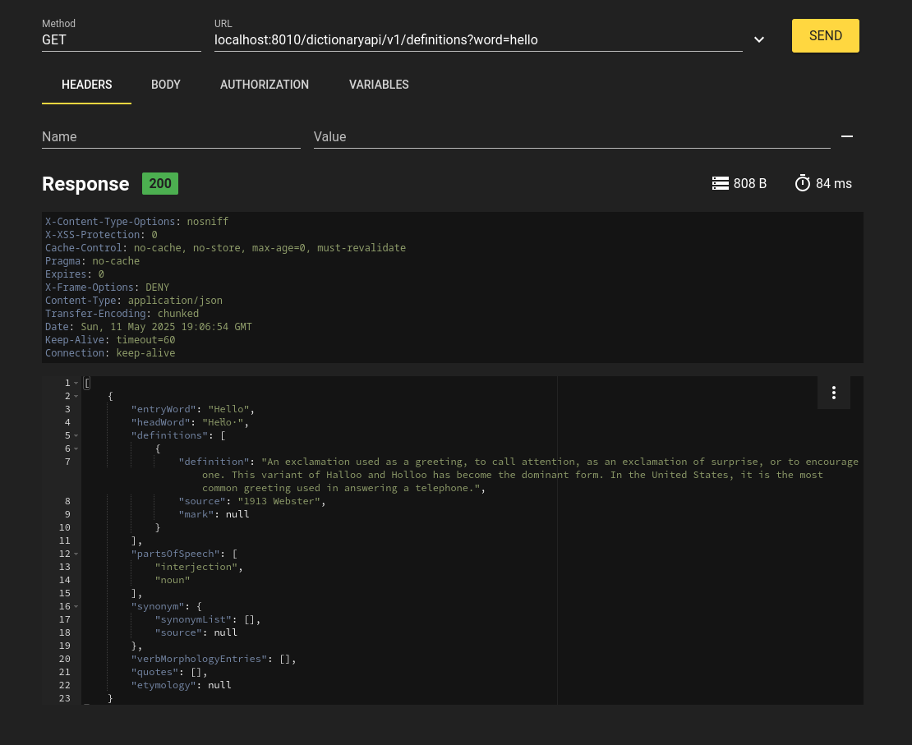

# Free Dictionary API

## Overview

This project is a **Java-based tool** designed to parse **GCIDE (The GNU Collaborative International Dictionary of English) XML data** and store it in a **local H2/SQLite database** for efficient querying (REST API) and usage.

## Features

- Parses and extracts dictionary data from GCIDE XML files.
- Stores structured data in an H2 relational database.
- Provides a foundation for fast lookups and efficient querying.
- Lightweight and easy to integrate into other applications.
- Query the database using REST endpoints.

## Technologies Used

- **Java** (JDK 17 or later)
- **H2 Database** (for local storage)
- **SQLite Database** (for local storage)
- **DOM API** (for XML parsing)
- **Spring Boot** (optional, for managing database interactions)
- **Docker** (optional, for containerizaton)

## Setup & Installation

### Prerequisites

- Ensure you have **Java 17+** installed.
  - The GCIDE XML dataset is downloaded from [GCIDE Project](https://gcide.gnu.org.ua/), 
    (with slight modification) and copied into resources directory.

### Steps to Run (container)

1. Clone this repository:
   ```sh
   git clone https://github.com/suvankar-mitra/free-dictionary-api.git
   cd free-dictionary-api
   ```
2. Build the project using Maven or Gradle:
   ```sh
   ./build-and-containerize.sh
   ```
3. Run the application using `docker`:
   ```sh
   docker run -d --restart unless-stopped --name free-dictionary-api -p 8010:8010 free-dictionary-api:latest
   ```
   
4. You can then access the API
   ```sh
   curl -v 'localhost:8010/dictionaryapi/v1/definitions?word=hello'
   ```

### Example Screenshots of data (RESTer)



## License
This project is licensed under the **GNU General Public License (GPL)**.

## Contributing

Pull requests are welcome! If you’d like to contribute, please open an issue first to discuss your changes.

---

*Project Repository:* [Free Dictionary API](https://github.com/suvankar-mitra/free-dictionary-api)

*Happy coding!* 🚀

